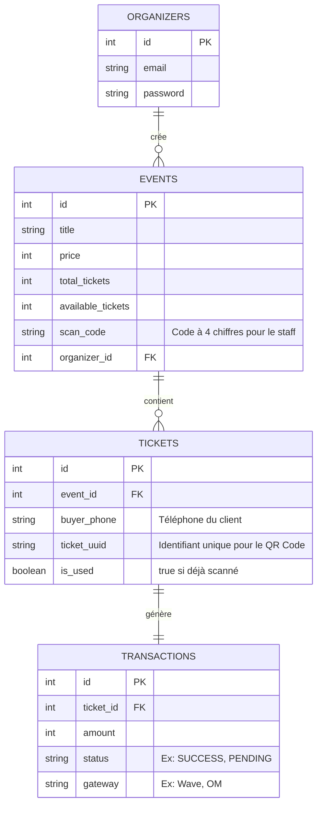

# Plan de Conception Simplifié : SENGUICHET

Ce plan est conçu pour être le **plus simple, direct et efficace possible**, en se basant sur ton idée : éliminer la connexion pour les acheteurs, simplifier le rôle du staff aux portes, et offrir une gestion simple pour les organisateurs.

---

## 1. Le Parcours Utilisateur (Le plus simple possible)

```mermaid
flowchart TD
    subgraph Mobile (Client)
        A[1. Parcourir les événements] --> B[2. Saisir son Téléphone et Payer]
        B --> C[3. Ticket enregistré localement avec son QR Code]
    end
    subgraph Web (Organisateur)
        D[1. Se connecter] --> E[2. Créer un événement]
        E --> F[3. Voir les tickets vendus et générer le Code de Scan]
    end
    subgraph Mobile (Staff)
        G[1. Entrer le Code de Scan de l'événement] --> H[2. Scanner le QR Code du Billet]
        H --> I{Valide ou Déjà Scanné ?}
    end
```

### 📱 A. L'Acheteur (Application Mobile)
1. **Pas d'inscription ni de connexion :** L'acheteur ouvre l'application mobile et choisit un événement.
2. **Achat instantané :** Il clique sur "Acheter", saisit uniquement son **numéro de téléphone** (indispensable pour le paiement mobile Wave / OM).
3. **Smart Ticket :** Le ticket est généré et **sauvegardé directement sur le téléphone** de l'utilisateur (mémoire locale). Pas besoin de compte pour y accéder !

### 💻 B. L'Organisateur (Espace Web)
1. **Connexion simple :** L'organisateur se connecte sur son espace web (Email / Mot de passe).
2. **Création rapide :** Il remplit un formulaire simple : *Nom de l'événement, Date, Prix, et Nombre de places*.
3. **Tableau de bord :** Il voit en temps réel :
   * Le nombre de tickets vendus.
   * La somme totale récoltée.
   * Un **Code de Scan** simple à 4 chiffres (ex: `2491`) généré automatiquement pour son événement.

### 📱 C. Le Staff / Contrôleur (Application Mobile)
1. **Pas de compte :** Le contrôleur n'a aucun compte à créer.
2. **Déverrouillage :** Sur l'application mobile, il clique sur un bouton "Mode Scanner", saisit le **Code de Scan** de l'événement (ex: `2491`).
3. **Scan :** L'appareil photo s'ouvre, il scanne le QR code du billet :
   * Si valide : **Écran Vert "Valide ✅"** et le ticket est marqué comme "utilisé" en base de données.
   * Si invalide ou déjà scanné : **Écran Rouge "Déjà Scanné ❌"** ou **"Faux Billet ❌"**.

---

## 2. La Base de Données ultra-simplifiée (MySQL)

Seulement **4 tables** simples pour faire fonctionner toute la plateforme.



---

## 3. Les Technologies Choisies

1. **Backend (L'API) :** **Node.js** avec **Express** (ultra rapide à mettre en place).
2. **Base de données :** **MySQL** (robuste, simple et classique pour tes examens/L3).
3. **Espace Organisateur :** **React.js** (Web) simple avec du style CSS épuré et moderne.
4. **Application Mobile (Client + Scan) :** **React Native (Expo)**. Une seule application mobile contenant la navigation client et le mode scanner déverrouillable.

---

## 4. Planning de Réalisation Pas-à-Pas (30 Jours)

### 🗓️ Semaine 1 : Le Cerveau (Base de données et API Backend)
*   **Objectif :** Créer la base de données MySQL et coder les routes de l'API Node.js :
    *   Créer un événement (organisateur).
    *   Acheter un ticket (générer le ticket lié au numéro de téléphone).
    *   Valider un ticket (marquer comme `is_used = true` après vérification du scan_code).

### 🗓️ Semaine 2 : Le Web (Espace Organisateur)
*   **Objectif :** Créer l'interface web React.js :
    *   Page de connexion pour l'organisateur.
    *   Formulaire simple pour créer un événement.
    *   Tableau de bord minimaliste affichant les ventes et le fameux **Code de Scan**.

### 🗓️ Semaine 3 : Le Mobile (Parcours Achat Client)
*   **Objectif :** Développer l'application mobile Expo pour l'acheteur :
    *   Affichage de la liste des événements sous forme de belles cartes.
    *   Formulaire d'achat ultra-rapide (saisie du téléphone + simulateur de paiement Wave/OM).
    *   Écran **"Mes Tickets"** qui affiche le QR Code généré en lisant le stockage local de l'appareil.

### 🗓️ Semaine 4 : Le Mobile (Mode Scanner & Tests)
*   **Objectif :** Finaliser le module scan et livrer l'application :
    *   Ajout du bouton "Scanner" sur l'application mobile.
    *   Saisie du Code de Scan à 4 chiffres pour ouvrir l'appareil photo.
    *   Scan du QR code et affichage des retours visuels (Vert/Rouge) avec gestion du hors-ligne (stockage local temporaire).
    *   Tests généraux et préparation de la démonstration pour ton projet de L3.
